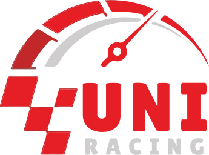

# 🏁 Introduction

**UNIRACING** is a play-to-earn car racing game where players and participants own parts of the game. Players can earn by playing interacting within the game. All ownable parts of the game are in the form of verifiably owned NFTs.&#x20;

<figure><figcaption></figcaption></figure>

\
**UNIRACING** is the first AI/ML integrated car racing game on **Ethereum** ecosystem. Within UNIRACING's metaverse, players can earn while enjoying various game modes to satisfy the thirst for speed, or make a profit by controlling in-game property and interacting with our ecosystem players. The two main game features are Pure Race and Battle Race. Pure Race includes two game modes: PvP and PvE. In PvE mode, the players will directly drive and control the car, whereas in PvP mode the players will customize their strategic statistics and then the AI system will analyze the result of the race. In terms of Battle Race, the players must upgrade their cars with battle features such as guns and shields. There will be no time limit or no finish line, the players will continue to race and attack each other until there is only one survivor left, and that car will become the winner of the battle race.&#x20;

The native platform currency of the game is the **UNIRACING** **UNI**, used for all in-game activities. Players will be able to race for free about two times per day, depending on the race class.&#x20;

To race, players buy gas at a gas station and then enter the race. The total of all the gas bought per race makes up the reward pool. First place wins 50% of the reward pool, second and third place split the second half of the pool. Winnings are paid out in **UNIRACING** **UNI** Tokens.&#x20;

When entering a race, players are presented with the Race Conditions. With this in mind, players select from several options that form their Race Strategy to compete in the race. The race then runs automatically based on the algorithm in the background. Results of the race are determined primarily by how well each racer's Race Strategy played out, and secondarily by a weighted random algorithm. Cars with higher XP and upgrades have an advantage in the race.&#x20;

Ownable parts of the game include: Cars, Gas Stations, Garage, Racetrack Land, Analytics Center and Billboard Land.
